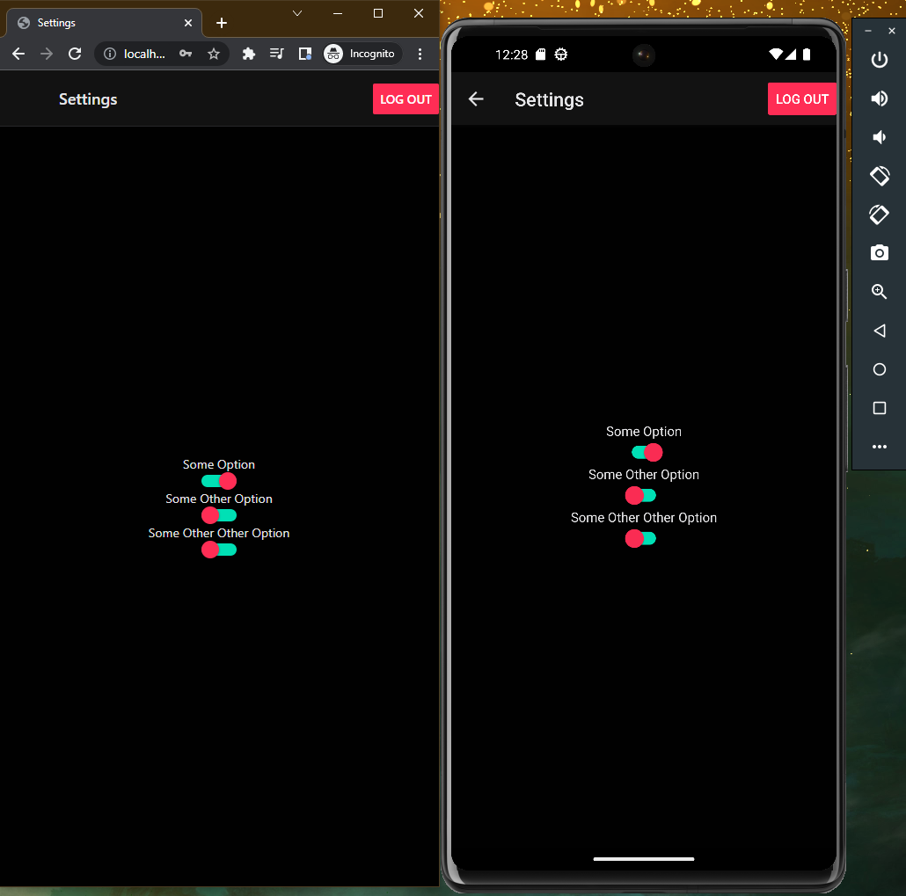

# Moweb

Moweb = Mobile + Web.

A multi-platform react native/react native web base app that can be server as an example, or expanded upon.

## Screenshot

Running simultaneously on chrome and android. Changes will instantly reflect on both when you save code changes in your text editor.


## Summary

This is a simple proof of concept.

It is modern as of November 2022.

It combines multiple example's ideas, along with my custom changes, to create a React Native application that works for iOS, Android, and web browsers. It attempts to display how many common problems can be solved.

## Features

- Typescript
- React Native
- React Native Web
- React Navigation
- Jest Testing
- example of basic automatic dark/light theming
- Simple but thorough example

## Installation and Use

### Requirements to run

Make sure you are already capable of running react native development on your system.

### iOS

```shell
> yarn
> cd ios
> pod install
> cd ..
> yarn start # preferably run the packager in a different terminal window
> yarn ios
```

Applicaton should open in an iOS simulator.

### Android

```shell
> yarn
> yarn start # preferably run the packager in a different terminal window
> yarn android
```

Applicaton should open in an Android emulator.

### Web

```shell
> yarn
> yarn web
```

Open a browser and go to _localhost:8080_.
